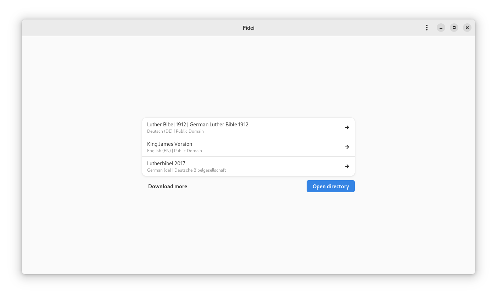

<div style="text-align: center;" align="center">


<h1><b>Fidei</b></h1>
<p><i>Take back your faith</i></p>
<p>Bible reader for GNOME</p>
</div>


<h2></h2>


## Screenshots




## Installation

### Prebuilt packages

There are prebuilt packages for Arch Linux, Debian, Fedora, openSUSE Leap and Tumbleweed aswell as Ubuntu available.
To install them, follow the instructions on [software.opensuse.org/download.html?project=home:sp1rit:fidei&package=fidei](https://software.opensuse.org//download.html?project=home%3Asp1rit%3Afidei&package=fidei) for your specific distro.

See the package [home:sp1rit:fidei/fidei](https://build.opensuse.org/package/show/home:sp1rit:fidei/fidei) on openSUSEs OBS instance for the package sources.

### Building from source

To build Fidei from source you need [gcc11](https://gcc.gnu.org/) or newer and the [meson](https://mesonbuild.com) buildsystem additionally to the dependencies listed under the [Dependencies](#dependencies) section.

Once all dependencies are fullfilled, invoking the following commands should build and install Fidei:
```sh
meson _build # Configure
ninja -C _build # Compile
meson install -C _build # Install
```

Depending on your operating system, you may want to consult `meson_options.txt` first and append additioanl build-options with -D&lt;name&gt;=&lt;value&gt; during the configure step.

#### Development Environment

If you want to hack on Fidei, you can use the meson provided devenv to avoid having to install Fidei each time you changed something. To make use of the devenv you need to invoke `meson devenv -C _build` after configuring. You can then build Fidei simply by invoking `ninja` without any further parameter and launch Fidei after compiling by simply invoking `fidei`.

To exit out of the environment send an EOF to the shell (&lt;Ctrl&gt;D) or type `exit`.

## Dependencies

| Library                                                        | pkg-config                     | Forge / Repository     |
|----------------------------------------------------------------|--------------------------------|------------|
| [glib2](https://wiki.gnome.org/Projects/GLib)                  | glib-2.0, gobject-2.0, gio-2.0 | [git@gitlab.gnome.org:GNOME/glib.git](https://gitlab.gnome.org/GNOME/glib/)             |
| [pango](https://www.pango.org/)                                | pango                          | [git@gitlab.gnome.org:GNOME/pango.git](https://gitlab.gnome.org/GNOME/pango/)           |
| [gtk4](https://www.gtk.org/)                                   | gtk4                           | [git@gitlab.gnome.org:GNOME/gtk.git](https://gitlab.gnome.org/GNOME/gtk/)               |
| [libadwaita](https://gnome.pages.gitlab.gnome.org/libadwaita/) | libadwaita-1                   | [git@gitlab.gnome.org:GNOME/libadwaita.git](https://gitlab.gnome.org/GNOME/libadwaita/) |
| [libxml2](https://xmlsoft.org)                                 | libxml-2.0                     | [git@gitlab.gnome.org:GNOME/libxml2.git](https://gitlab.gnome.org/GNOME/libxml2/)       |
| [libicu](https://icu.unicode.org)*                             | icu-uc                         | [git@github.com:unicode-org/icu.git](https://github.com/unicode-org/icu)                |

Optional dependencies are marked with \*

## Bible file-format

Bible files are XML files in [Zefania](https://www.bgfdb.de/zefaniaxml/bml/) format. While not strictly required, the bible file needs to contain the `<INFORMATION>` tag and provide the `bsname` attribute in `<BIBLEBOOK>`s to work propertly.

Fidei scans for bibles in `${XDG_DATA_HOME:-$HOME/.local/share}/arpa.sp1rit.Fidei` on app launch and makes them available in the bible picker (first view on first launch and later accesible in the menu).

A good source for such bibles is [bible4u.app](https://bible4u.app/download.html).
